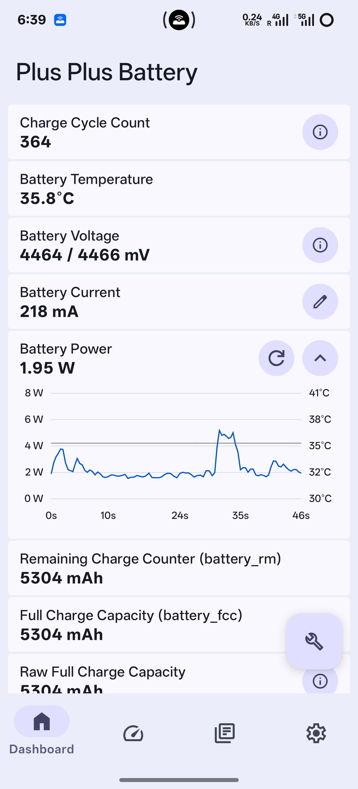
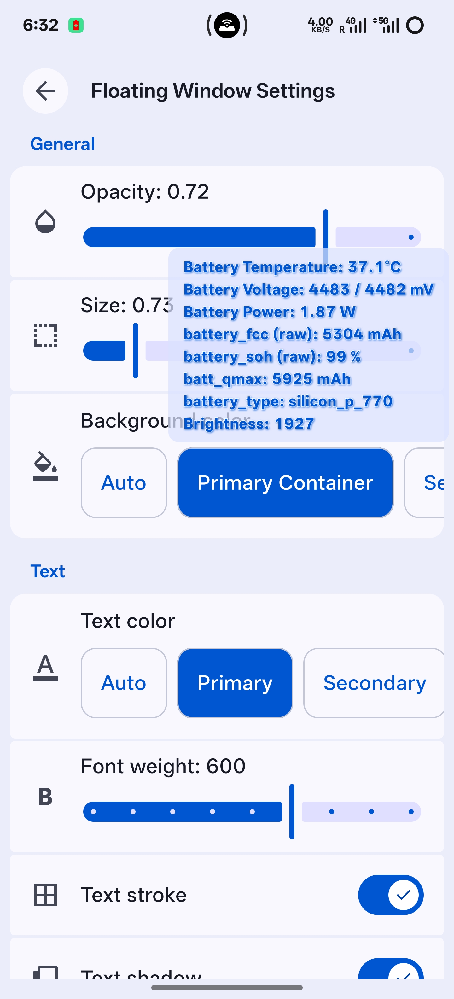
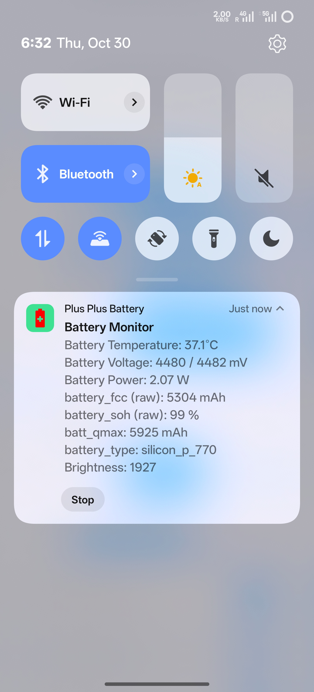
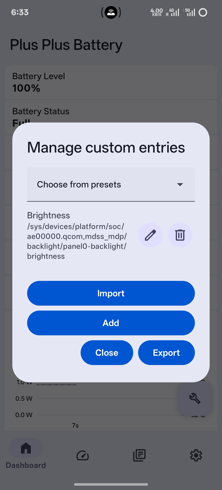
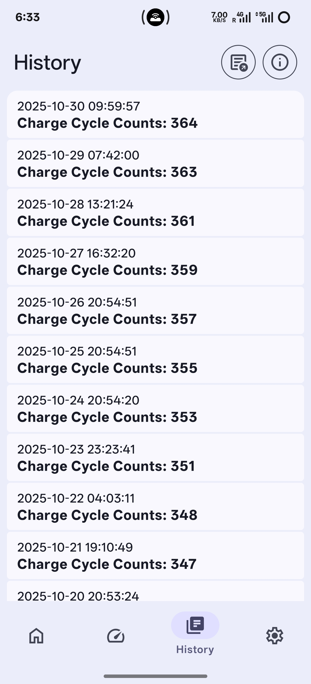

# PlusPlusBattery - OPlus 裝置電池資訊檢視器

[繁體中文](./README.zh-Hant.md) | [简体中文](./README.zh.md) | English

## 簡介

`PlusPlusBattery` 是一款輕量級的電池資訊與健康度評估工具，專為 OnePlus/Oppo/Realme 裝置（並支援通用裝置）量身打造。它能即時監控電池狀態，並在特定條件下評估矽碳負極電池的完全充電容量（FCC）、未經補償的原始 FCC 及健康狀態（SOH）。

## 功能

- **即時電池資訊**：無需 root 權限即可顯示目前電量、電壓、電流、充放電功率圖表及健康狀態。
- **電池健康度評估**：僅在電量達到 100% 且電池電流介於 0 至 20 mA 之間時，計算並記錄完全充電容量。此數值用於評估電池健康度與壽命，並非精確值，僅為估算。
- **循環次數歷史記錄**：自動或手動記錄每日的電池循環次數，並使用 Room 資料庫儲存於本機。使用者可在歷史頁面檢視，並匯出為 CSV 檔案。
- **即時電池監控**：在可自訂的懸浮視窗或通知區域中顯示電池指標。資訊項目可自訂。
- **Root 模式**：需要 root 權限以讀取額外資訊。
- **目前剩餘容量 (Root 模式)**：讀取自 `/sys/class/oplus_chg/battery/battery_rm`。此數值會隨電量變化。
- **完全充電容量 (battery_fcc) (Root 模式)**：讀取自 `/sys/class/oplus_chg/battery/battery_fcc`。此數值會根據充放電行為波動。
- **原始完全充電容量 (Root 模式)**：反向計算得出的未補償 FCC。矽碳負極電池通常會根據低電壓閾值進行演算法補償。
- **電池健康度 (battery_soh) (Root 模式)**：讀取自 `/sys/class/oplus_chg/battery/battery_soh`。此數值會隨使用情況波動。
- **原始電池健康度 (Root 模式)**：反向計算得出的未補償 SOH。矽碳負極電池通常會根據低電壓閾值進行補償。
- **電池低電壓閾值 (vbat_uv) (Root 模式)**：讀取自 `/sys/class/oplus_chg/battery/vbat_uv`。當電壓低於此閾值時，裝置將會關機。
- **電池序號 (battery_sn) (Root 模式)**：讀取自 `/sys/class/oplus_chg/battery/battery_sn`。
- **電池製造日期 (battery_manu_date) (Root 模式)**：讀取自 `/sys/class/oplus_chg/battery/battery_manu_date`。
- **Qmax (batt_qmax) (Root 模式)**：Qmax 指的是電池的化學容量。此容量值與負載無關，代表電池在極低負載電流下可釋放的容量，通常以 mAh 表示。在系統中，此數值會因某些條件觸發而改變。
- **自訂項目 (Root 模式)**：為通用裝置提供可自訂的項目，預設會顯示來自通用 Linux power_supply 檔案的充電循環次數和 FCC。您也可以隨意新增任何其他可讀取的路徑。使用者還可以匯出/匯入自訂設定檔。

## 實驗性功能
- **從 Logcat 獲取電池資料 (Root 模式)**：對於某些裝置，本應用程式可以從 logcat 中提取電池相關資料。目前支援部分 OPlus、Moto 和小米裝置（支援程度因型號和系統而異）。

## 螢幕截圖

  
  
  
  
  

## 下載

或從 [Github Release](https://github.com/dijia1124/PlusPlusBattery/releases) 下載 APK

## 安裝

1. 確保您的 OnePlus 裝置正在執行較新版本的 ColorOS 或 OxygenOS（例如 ColorOS 15），或較新的 AOSP-based ROM。
2. 前往 Release 頁面下載並安裝 APK。
3. 啟動應用程式。
4. （可選）授予 root 權限。
5. （可選）若要使用電池監控通知：需在系統設定中關閉 PlusPlusBattery 的電池最佳化。此外，對於 ColorOS 15 使用者，還需要在系統設定中為 PlusPlusBattery 啟用「自動啟動」權限，以確保監控服務能根據螢幕開啟/關閉狀態正常地恢復/暫停。
6. （可選）對於非 Oppo/OnePlus/Realme 裝置，您可能會想停用「顯示 OPlus 專屬項目」選項以隱藏 root 模式下那些無用的資料，並編輯自訂項目以符合您的需求。

## 鳴謝

特別感謝 [@shminer](https://github.com/shminer) 提供核心原始碼、演算法邏輯以及有關 FCC 和 SOH 補償的見解。

## 貢獻者

## 授權條款

本專案採用 MIT 授權條款。詳情請參閱 `LICENSE` 檔案。
